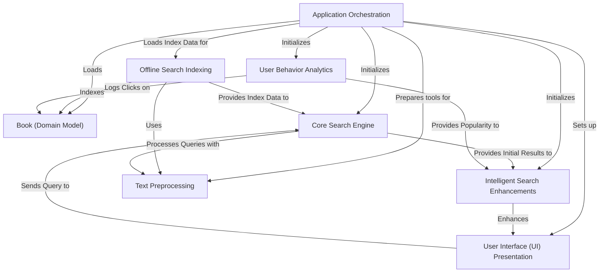

# Tutorial: DevShelf

DevShelf is a **digital library search engine** that helps users *discover and read programming books*.
It intelligently **searches for books** using a pre-built index, provides "Did you mean?" suggestions, and offers
*personalized recommendations* based on book details and user popularity. The system also tracks user clicks
to continuously improve its search results and recommendations, presenting information through both command-line
and graphical interfaces.

## Visual Overview

## Chapters

1. [User Interface (UI) Presentation](./01%20user%20interface%20presentation.md)
2. [Book (Domain Model)](./02%20book%20domain%20model.md)
3. [Application Orchestration](./03%20application%20orchestration.md)
4. [Core Search Engine](./04%20core%20search%20engine.md)
5. [Text Preprocessing](./05%20text%20preprocessing.md)
6. [Offline Search Indexing](./06%20offline%20search%20indexing.md)
7. [Intelligent Search Enhancements](./07%20intelligent%20search%20enhancements.md)
8. [User Behavior Analytics](./08%20user%20behavior%20analytics.md)

