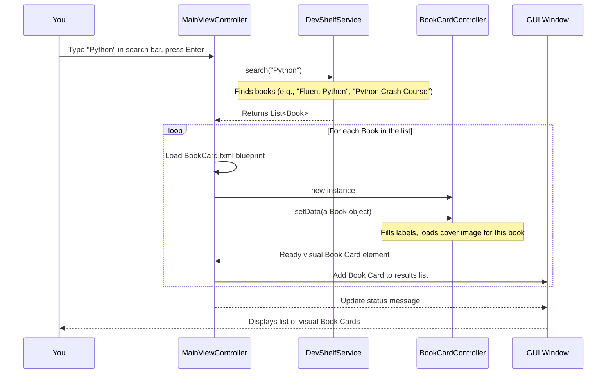

# Chapter 1: User Interface (UI) Presentation

Welcome to the exciting world of DevShelf! This is where we begin our journey into understanding how this awesome digital library works. Think of DevShelf like a person you're meeting for the first time. The very first thing you notice is their face – how they look, how they smile, and how they react when you talk to them.

In the world of software, this "face" is called the **User Interface (UI)**.

### What is the "Face" of DevShelf?

The User Interface (UI) Presentation is literally **everything you see and interact with** when you use DevShelf. It's how the application "talks" to you and how you "talk" back to it.

Imagine DevShelf as a super-smart librarian. This librarian knows about thousands of books, but without a way to communicate, you'd never know what books they have! The UI is the librarian's ability to:

1.  **Show Information:** Display a list of books, tell you a book's title, author, and rating, or show a welcome message.
2.  **Gather Input:** Understand when you type a search query, click a button, or choose an option.

It takes all the complex information and powerful search logic happening "behind the scenes" and translates it into something simple, clear, and easy for you to use.

#### The Problem Our UI Solves

Let's consider a central task: **finding and viewing books**.

You want to search for "Java" books. How do you type "Java"? And once DevShelf finds those books, how does it *show* them to you? Without a UI, DevShelf would be a brilliant system that couldn't interact with anyone! Our UI solves this by providing the visual elements and interaction points needed to make this simple.

### Two Ways DevShelf Shows Its Face: CLI vs. GUI

DevShelf actually has two different "faces," or types of UIs, to cater to different user preferences:

1.  **CLI (Command Line Interface):** This is a text-based interface. You type commands, and DevShelf responds with text. It's like talking to our librarian by writing notes and getting notes back.
2.  **GUI (Graphical User Interface):** This is a visual interface with windows, buttons, pictures, and more. You use your mouse and keyboard to click, type, and navigate. It's like talking to our librarian face-to-face in a beautifully designed library.

Both UIs achieve the same goal: letting you search for books and see the results.

#### 1. The CLI's Face: Simple Text Commands

In the CLI version, the `CliView` class is the main component for displaying text and reading your input. It’s straightforward: it prints messages, then waits for you to type something.

**`src/main/java/ui/cli/CliView.java` (Simplified)**
```java
package ui.cli;

import domain.Book; // Our book data structure from the next chapter
import java.util.List;
import java.util.Scanner; // Tool to read keyboard input

public class CliView {
    private final Scanner scanner = new Scanner(System.in);

    public void showResults(String query, List<Book> books) {
        if (books.isEmpty()) {
            System.out.println("❌ No results found for \"" + query + "\"");
            return;
        }
        System.out.println("✅ Showing results for \"" + query + "\":");
        for (int i = 0; i < books.size() && i < 3; i++) { // Show top 3 for brevity
            Book book = books.get(i);
            System.out.printf("  [%d] %s by %s (Rating: %.1f)\n",
                    i + 1, book.getTitle(), book.getAuthor(), book.getRating());
        }
    }

    public String getSearchQuery() {
        System.out.print("\n🔍 Enter search query (or 'exit'): ");
        return scanner.nextLine().trim(); // Reads what you type
    }
}
```
*   `showResults`: This method takes a search query and a list of `Book` objects (which we'll learn more about in [Book (Domain Model)](02_book__domain_model__.md)). It then prints out the details of each book directly to your console.
*   `getSearchQuery`: This method displays a prompt asking you to type your search query. It then waits until you press Enter, captures your typed text, and returns it.

**Example CLI Interaction:**

```
🔍 Enter search query (or 'exit'): Java

✅ Showing results for "Java":
  [1] Clean Code by Robert C. Martin (Rating: 4.6)
  [2] Effective Java by Joshua Bloch (Rating: 4.8)
  [3] Head First Java by Kathy Sierra (Rating: 4.3)
```
In this example, `getSearchQuery` printed the prompt, you typed "Java", and then `showResults` displayed the books found.

#### 2. The GUI's Face: Windows, Buttons, and Images

The GUI version of DevShelf uses a special framework called **JavaFX** to create visually rich interfaces. Instead of just printing text, it draws everything: windows, buttons, text boxes, and even book covers!

Building a GUI with JavaFX often involves two main ingredients:

1.  **FXML Files (The Blueprints):** These are like architectural drawings for what your screens look like. They describe *where* each button, label, and image should be placed, and *how* they are organized. For DevShelf, we have blueprints like `MainView.fxml` (for the main search screen) and `BookCard.fxml` (for how a single book looks in the results list).
2.  **Controller Classes (The Workers):** These are Java classes (like `.java` files in the `ui.gui.controllers` package) that are the "brains" behind the FXML blueprints. They handle *what happens* when you click something, *how to fill* a text field with data, and *how to react* to your actions. Each FXML blueprint usually has a dedicated worker (controller).

Let's trace how these pieces work together when you search for a book in the GUI:


This diagram shows that when you type a query in the GUI, the `MainViewController` (the main screen's brain) asks a central `DevShelfService` (the application's core brain) for results. For each [Book (Domain Model)](02_book__domain_model__.md) it gets back, the `MainViewController` uses the `BookCard.fxml` blueprint and its `BookCardController` worker to create a visual "card" for that book, and then displays it in the window.

### Displaying Search Results and Handling New Searches (Code Examples)

Let's look at how the GUI code actually makes this happen.

#### The Main Search Screen (`MainView.fxml` & `MainViewController.java`)

The `MainView.fxml` is the blueprint for our main screen. It defines elements like the search box and where the results go.

**`src/main/resources/ui/gui/fxml/MainView.fxml` (Snippet)**
```xml
<!-- ... other layout definitions ... -->
<HBox alignment="CENTER" spacing="10.0">
    <TextField fx:id="searchField" onAction="#handleSearch" promptText="Search for books..." />
    <Button fx:id="searchButton" onAction="#handleSearch" text=" Search 🔍" />
</HBox>

<ScrollPane fitToWidth="true">
    <VBox fx:id="resultsContainer" spacing="10.0" style="-fx-padding: 20;">
    </VBox>
</ScrollPane>
<!-- ... other layout definitions ... -->
```
*   `fx:id="searchField"`: This gives a unique name to the search text box so our Java code can easily find and use it.
*   `onAction="#handleSearch"`: This tells JavaFX: "When the user presses Enter in this box or clicks the search button, call a method named `handleSearch` in our `MainViewController`."
*   `fx:id="resultsContainer"`: This is a special vertical box (`VBox`) where our program will dynamically add the visual "Book Cards" after a search.

Now, let's see the `MainViewController` code that brings this blueprint to life:

**`src/main/java/ui/gui/controllers/MainViewController.java` (Simplified)**
```java
package ui.gui.controllers;

import domain.Book; // Our Book data from Chapter 2
import javafx.fxml.FXML;
import javafx.fxml.FXMLLoader; // To load FXML blueprints
import javafx.scene.Node;     // A general UI element
import javafx.scene.control.TextField;
import javafx.scene.layout.VBox;
import ui.gui.services.DevShelfService; // The app's "brain"

import java.io.IOException;
import java.util.List;

public class MainViewController {
    @FXML private TextField searchField; // Connected to the search box in FXML
    @FXML private VBox resultsContainer; // Connected to the results area in FXML

    private DevShelfService service; // Will be set by the main application

    public void setService(DevShelfService service) { this.service = service; }

    @FXML // This method is called when you search
    private void handleSearch() {
        String query = searchField.getText(); // Get text from the search box
        if (query == null || query.trim().isEmpty()) return;

        List<Book> books = service.search(query).books; // Ask the "brain" for books
        displayBooks(books); // Show the books
    }

    private void displayBooks(List<Book> books) {
        resultsContainer.getChildren().clear(); // Clear old books

        for (Book book : books) { // For each book found
            try {
                FXMLLoader loader = new FXMLLoader(getClass().getResource("/ui/gui/fxml/BookCard.fxml"));
                Node card = loader.load(); // Load the blueprint for a book card

                BookCardController cardController = loader.getController();
                cardController.setData(book); // Tell the card to show this book's data

                card.setOnMouseClicked(e -> openDetailsView(book)); // Make card clickable
                resultsContainer.getChildren().add(card); // Add the card to the screen
            } catch (IOException e) { /* handle error */ }
        }
    }
    // ... other methods like openDetailsView ...
}
```
*   `handleSearch()`: When you type in `searchField` and press Enter, this method is called. It fetches your query, asks the `service` (the core logic of DevShelf) for relevant books, and then calls `displayBooks`.
*   `displayBooks()`: This method is the star! It clears any old results, then for each `Book` it received, it does the following:
    1.  Uses `FXMLLoader` to load the `BookCard.fxml` blueprint, creating a new visual "card" element.
    2.  Gets the `BookCardController` for *that specific card*.
    3.  Calls `cardController.setData(book)` to tell the card to fill itself with the `Book`'s title, author, etc.
    4.  Makes the card clickable to show more details.
    5.  Adds this completed `card` to the `resultsContainer`, making it appear on the screen.

#### The Single Book Card (`BookCard.fxml` & `BookCardController.java`)

Each book in the search results is a separate `BookCard`. Here’s its blueprint:

**`src/main/resources/ui/gui/fxml/BookCard.fxml` (Snippet)**
```xml
<!-- ... styling and layout for a nice card effect ... -->
<HBox alignment="CENTER_LEFT" spacing="15.0"
      xmlns="http://javafx.com/javafx/17" xmlns:fx="http://javafx.com/fxml/1"
      fx:controller="ui.gui.controllers.BookCardController">

    <ImageView fx:id="coverImage" fitHeight="100.0" fitWidth="70.0" />
    <VBox spacing="5.0" HBox.hgrow="ALWAYS">
        <Label fx:id="titleLabel" text="Book Title" />
        <HBox spacing="10.0" alignment="CENTER_LEFT">
            <Label fx:id="authorLabel" text="Author Name" />
            <Label fx:id="ratingLabel" text="4.7 ★" />
        </HBox>
    </VBox>
</HBox>
```
*   This FXML describes a horizontal box (`HBox`) that contains an `ImageView` for the book cover and a `VBox` for the title, author, and rating `Label`s.
*   The `fx:id` attributes link these visual elements to our controller.

And here's the worker that fills the card with actual book data:

**`src/main/java/ui/gui/controllers/BookCardController.java` (Simplified)**
```java
package ui.gui.controllers;

import domain.Book;
import javafx.fxml.FXML;
import javafx.scene.control.Label;
import javafx.scene.image.Image;
import javafx.scene.image.ImageView;

public class BookCardController {
    @FXML private Label titleLabel;
    @FXML private Label authorLabel;
    @FXML private Label ratingLabel;
    @FXML private ImageView coverImage;

    // This method is called by MainViewController to fill the card
    public void setData(Book book) {
        titleLabel.setText(book.getTitle());
        authorLabel.setText(book.getAuthor());
        ratingLabel.setText(String.format("%.1f ★", book.getRating()));

        // Try to load the book's cover image
        String url = (book.getCoverUrl() != null && !book.getCoverUrl().isEmpty())
                ? book.getCoverUrl() : "https://via.placeholder.com/150x200?text=No+Cover";
        try {
            coverImage.setImage(new Image(url, true)); // Load image from URL
        } catch (Exception e) { /* Fallback silently */ }
    }
}
```
*   The `setData` method receives a [Book (Domain Model)](02_book__domain_model__.md) object.
*   It then takes the information from that `Book` and updates the corresponding `Label`s and `ImageView` on the card, making the book visually appear in the search results.

#### The Book Detail View (`BookDetailView.fxml` & `BookDetailController.java`)

When you click on a `BookCard`, DevShelf shows you a new, larger view with all the book's details.

**`src/main/java/ui/gui/controllers/BookDetailController.java` (Simplified `setBookData`)**
```java
package ui.gui.controllers;

import domain.Book;
import javafx.fxml.FXML;
import javafx.scene.control.Label;
import javafx.scene.image.Image;
import javafx.scene.image.ImageView;
import javafx.scene.text.Text;

public class BookDetailController {
    @FXML private ImageView largeCoverImage;
    @FXML private Label fullTitle;
    @FXML private Label authors;
    @FXML private Text descriptionText;

    // This method is called when the details window opens
    public void setBookData(Book book, /* ... other details ... */) {
        fullTitle.setText(book.getTitle());
        authors.setText(book.getAuthor());
        descriptionText.setText(book.getDescription());

        String url = (book.getCoverUrl() != null && !book.getCoverUrl().isEmpty())
                     ? book.getCoverUrl()
                     : "https://via.placeholder.com/150x200?text=No+Cover";
        largeCoverImage.setImage(new Image(url, true));
    }

    @FXML private void handleBack() { /* Code to close this window */ }
    @FXML private void handleRead() { /* Code to open book PDF */ }
}
```
*   The `setBookData` method receives a [Book (Domain Model)](02_book__domain_model__.md) object and populates all the detailed labels and the larger cover image on the screen, giving you a full overview of the book.

### Comparing CLI and GUI for User Interface Presentation

Here’s a quick summary of how the two interfaces work:

| Feature                   | CLI Version (`CliView.java`)                  | GUI Version (JavaFX FXML & Controllers)                                            |
| :------------------------ | :-------------------------------------------- | :--------------------------------------------------------------------------------- |
| **How Info is Shown**     | `System.out.println()` for plain text         | Visual elements like `Label`, `ImageView`, `VBox` defined in FXML, managed by Java |
| **How Input is Gathered** | `Scanner.nextLine()` reads typed text         | `TextField` for typing, `Button` for clicking (FXML defined, Java handled)         |
| **Appearance**            | Text-only, limited formatting                 | Rich graphics, colors, fonts, images defined in FXML and styled with CSS           |
| **Core Parts**            | `CliView` class                               | FXML files (blueprints) and Controller classes (workers)                           |
| **Interaction Style**     | Sequential: Prompt -> Type -> Enter -> Output | Event-driven: Clicks and types trigger specific actions                              |

### Conclusion

In this chapter, we learned that "User Interface (UI) Presentation" is the "face" of DevShelf. It's how the application communicates with you, showing you information like search results and gathering your input like search queries.

We saw that DevShelf offers two types of faces:
*   The **CLI** (Command Line Interface) for a text-based experience using the `CliView` class.
*   The **GUI** (Graphical User Interface) for a visual experience using JavaFX, where **FXML files** act as blueprints for the layout, and **Controller classes** (like `MainViewController` and `BookCardController`) act as workers to manage behavior and display the book data.

Understanding the UI is crucial because it's your window into the DevShelf system. Now that we know how books are presented to you, let's dive into the core data structure that holds all the information about these books!

[Next Chapter: Book (Domain Model)](02_book__domain_model__.md)
